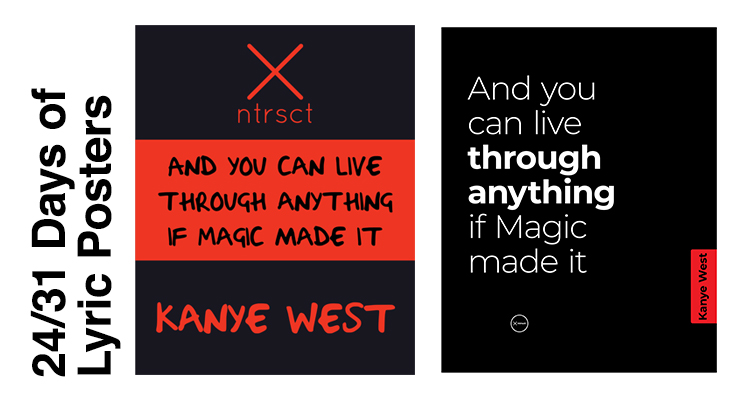
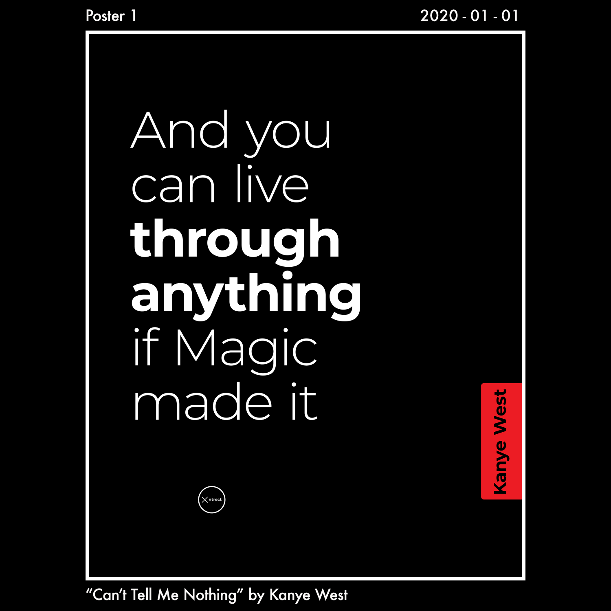
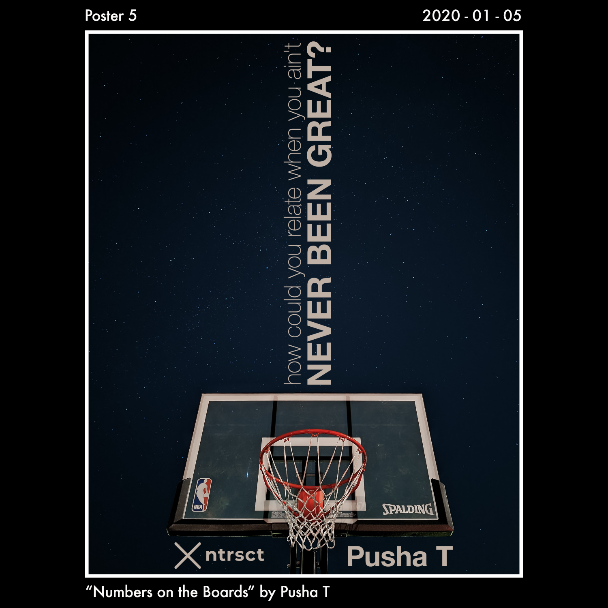
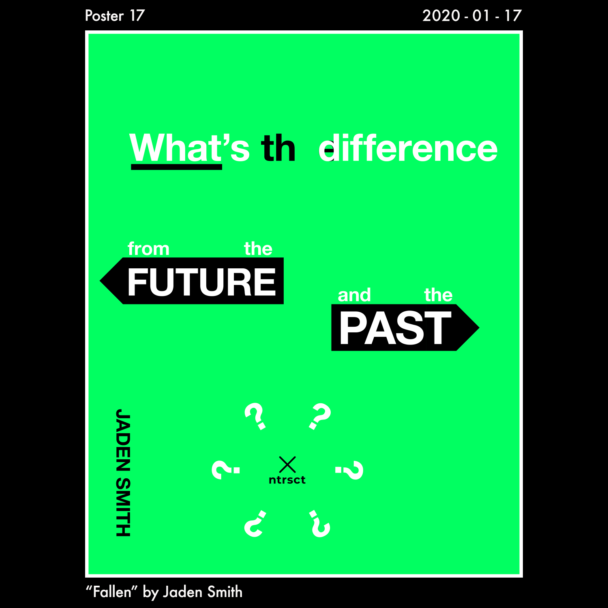
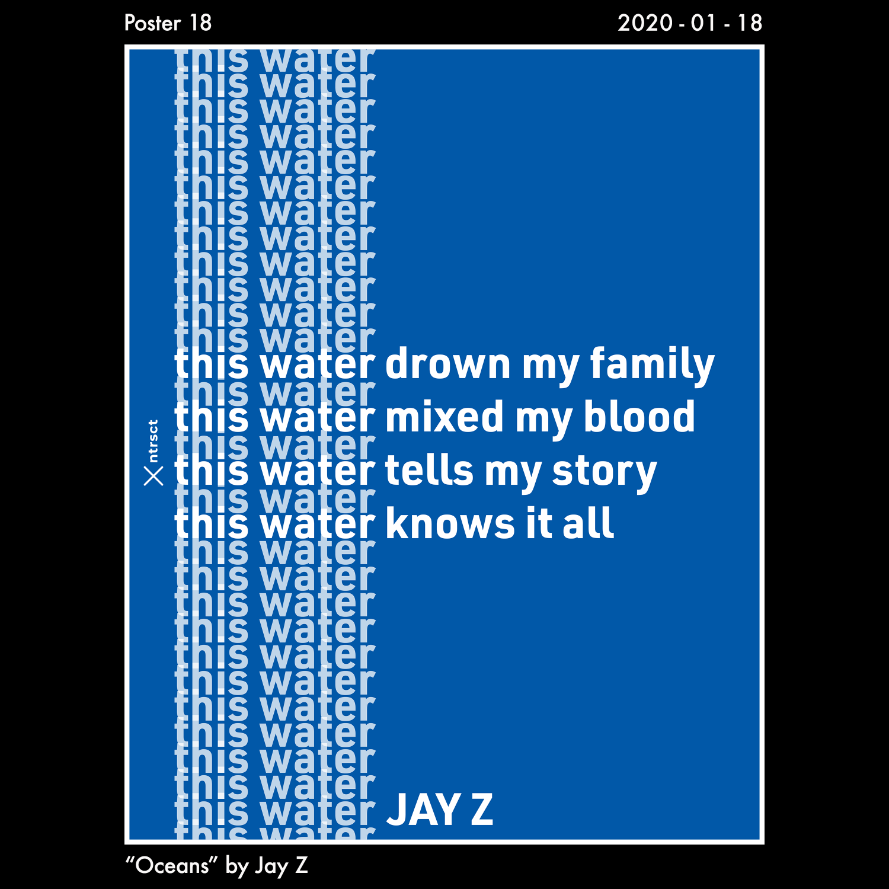

For the month of January, I challenged myself to level up my typography and overall graphic design skills by designing a poster every day.

Of the 31 days in January, I ended up designing 24 daily posters - this was a huge win for me in terms of going through design process and sharing my results on Instagram every day. Yup, I missed 7 days total and I have **no regrets**. Life got crazy, and I'm learning to love myself enough to not stress over perfection. I decided to have each poster represent song lyrics that have really impacted me from my favorite artists: **24 unique artists for 24 days**.

One year ago (January 2019) I designed my first poster which... was kind of a disaster, you'll see it in the first image below. 😅 I used a very strange typeface, the kerning (letter spacing) is all crazy, and there's no sense of hierarchy. After soaking up all the amazing content from Chris Do from The Futur (both free [YouTube](https://www.youtube.com/user/TheSkoolRocks) content and the [Typography course](https://academy.thefutur.com/p/typography-01)), I recognized learned what I was missing back then. **I saw the light**. So I knew I needed to put some of this into practice, and this daily poster design challenge was born. What better place to start than to redesign that first poster, so I did just that.

These posters aren't perfect, some of them were downright bad. But I've expanded my creativity under time constraints, which is an invaluable lesson for my design journey.

**I've included 4 of my favorite posters below**, feel free to check out the others on my company's Instagram account: [@ntrsct.designs](https://www.instagram.com/ntrsct.designs/). I still have a lot to learn, but I've fallen even more in love with the design process during this journey. Looking forward to writing a future post about a daily logo design challenge at some point!

As a preview, I've included a list of all 24 songs, artists and the lyrics I used for the posters. In order, the list of all songs & lyrics I used for the posters. Reading just the lyrics in order tells an interesting story 🤔

1. Can't tell me nothing by Kanye West - "And you can live through anything if Magic made it"
2. Myself by Nav - "I got a lot of enemies who used to be my friends"
3. Trust Nobody by 070 Shake - "Movin' on and we ain't looking back for what we left"
4. Dark Sky (Skyscrapers) by Big Sean - "Started from the basement made it to the skyscrapers"
5. Numbers on the Boards by Pusha T - "How could you relate when you ain't never been great?"
6. Never Know by 6lack - "I don't fear no man or no object Bullfighter, I've been working on my sidestep"
7. Yosemite by Travis Scott - "I feel like I'm chosen, I'm covered in gold"
8. Shutdown by Sktepta - "They try to steal my vision this ain't a culture, it's my religion"
9. Up Up & Away by Kid Cudi - "I'll be up-up and away, up-up and away 'cause they gon' judge me anyway so, whatever"
10. Thugz Mansion by Nas - “Leave all the stress of the world outside, every wrong done will be alright”
11. Do What I Want by Lil Uzi Vert - "I'm on some sh*t like, now I do what I want"
12. 92 Explorer by Post Malone - "I lost all my friends, made a lot of foes made a lot of M's, made a lot of O's"
13. This Plane by Wiz Khalifa - "Don't know what they hate for I'm just gettin' my paper. Well, maybe they'll love me more when I'm gone. I don't wanna leave, but I need to, it's such a shame. They gon' miss this plane (x4). I try to believe you, I don't wanna leave but I need to"
14. Tell Me When To Go by E-40 - “Not just the cops, but the homies you got to watch, the moon is full, look at the dark clouds sitting in my scraper, watching Oakland Gone Wild, ta-dow”
15. Tell Your Friends by The Weeknd - "Cruise through the West End in my new Benz, I'm just tryna live life through a new lens"
16. Robbery by Juice WRLD - "I'm a whole different person it's a gift and a curse but I cannot reverse it"
17. Fallen by Jaden Smith - "What's the difference from the future and the past?"
18. Oceans by Jay Z - "This water drown my family, this water mixed my blood, this water tells my story, this water knows it all"
19. Matrix by A.CHAL - "I never bent down when they threw the cash"
20. Mortal Man by Kendrick Lamar - "How many leaders you said you needed then left 'em for dead? Is it Moses? Is it Huey Newton or Detroit Red? Is Martin Luther? JFK? Shooter–you assassin Is it Jackie? Is it Jessie? Oh, I know it's Michael Jackson"
21. Seigfried by Frank Ocean - "This is not my life, it's just fond farewell to a friend, it's just a fond farewell to a friend"
22. Bonfire by Childish Gambino - "Put my soul on the track like shoes did"
23. Kobe by Chief Keef - "I been ballin' so damn hard I swear I think that I'm Kobe"
24. CREAM by Wu-Tang Clan - "Handcuffed in the back of a bus, forty of us life a short shouldn't be so rough"

## Here's my 4 favorite posters from the month!

Thank you for taking the time to read this post, I've love to know what you thought of it!