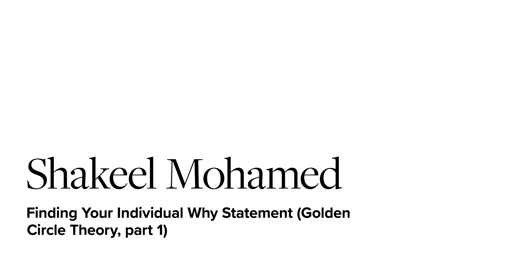

I've been intrigued by Simon Sinek's work for many years. I knew his Golden Circle Theory is an incredible idea but, I didn't know how to apply it in my daily life.

## What are WHY statements?

A WHY statement is not aspirational. That's a vision statement.

> **The WHY statement is who we are, stories are the proof.**

A WHY statement is not specific to one area of life, it's a more foundational belief that affects all areas of life. The way you express that why is through your HOWs (family, work, hobbies, etc.).

## My Why Statement

After my individual WHY discovery session, I came out with a draft of my WHY statement. It was close but didn't really have the juice that my final WHY statement does. I mulled it over for a week and finally landed on the following:

> **To relentlessly pursue being world-class, so that we can experience beyond what's possible.**

## Golden Circle Theory

I could try to explain the concept in depth but, there's no replacement for Simon's explanation in his original TED talk! The core idea is that we should all start with WHY we do what we do. Our HOWs are our strengths, and the filters we use to decide WHAT we do.

<iframe width="560" height="315" src="https://www.youtube.com/embed/qp0HIF3SfI4" frameborder="0" allow="accelerometer; autoplay; encrypted-media; gyroscope; picture-in-picture" allowfullscreen></iframe>

## How did we get here?

When confronted with some challenges as a leader last year, I sought the guidance of one of my mentors. "Think about **alignment** with your goal, and their beliefs." This really got me thinking, "what do other people care about?". Then I remembered Simon's TED talk about Golden Circle Theory, and that his first book [_Start With Why_](https://amzn.to/3cjZ3M4) was on my reading list. So I read it over the next few weeks. I was already familiar with the concept however, so I didn't receive as much value as I would've had it been fresh. To put that in context, the book came before his TED talk... back in 2009!

## Total Immersion

Once I finished reading [_Start With Why_](https://amzn.to/3cjZ3M4), I felt a little bit empty inside. I had many examples and evidence for **WHY** his Golden Circle Theory is so important. I still didn't know how to apply it to my life, or any team I am involved with. After a very quick Amazon search, found that Simon had more recently co-authored a book, called [_Find Your Why_](https://amzn.to/2yOfH8T). This book is all about the practical steps needed to uncover WHY statements for individuals and groups.

# WHY 101

I've prepared a [Google doc](https://docs.google.com/document/d/e/2PACX-1vSgeXDNI6KqJmyiuDtIRO7AJiLnvotTsvQJJtOzMNrmEsdLyasB6_VTCajJJQO214xvRwNzXbbtWWB3/pub) with everything you need to get started for discovering or facilitating an individual why statement. Feel free to download that, but I'll run through the content below.

## Preparation For Storytellers

Before the session
* Watch [Simon's TED talk (20 mins)](https://www.youtube.com/watch?v=qp0HIF3SfI4)
* Select a facilitator, they shouldn't be someone already close to the storyteller to avoid bias
* Collect stories
* Circle 3 most impactful stories, share those first
* Be open and vulnerable when sharing
* Remember the goal is to uncover who you are, not just share some stories

Story Collection
* Collect stories and experiences that affected your life and shapes who you are
    - At least 5 specific stories about a time/place/moment
* Mix of positive and negative stories 
* Stories will include the most important people in your life
* Any events that meant something to you, helped you become who you are, taught you some or made you proud
* Anything from birth until now

Methods for finding stories
* Memory prompts (list of questions in the book):
    - Who in your life has helped make you the person you are today?
    - Have you ever said "I would have done that for free? What happened that day?"
    - What happened on your worst day of work?
    - What is the earliest, specific, happy childhood memory you have?
    - At school, what was an experience you loved?
    - What has been a pivotal moment in your life, when life changed forever for you?
    - What happened to change the way you think about the world, and your role in it?
    - Have you ever given yourself to help someone, when you felt amazing after?
    - What have you accomplished that you're really proud of? With anyone?
* Peaks/valleys over your life on a timeline, the more extreme ones will have more impact. Pick those because they'll most clearly lead to your WHY due to the strong emotions tied to them.

## For Facilitators
* Watch [Simon's TED talk (20 mins)](https://www.youtube.com/watch?v=qp0HIF3SfI4)
* Read the [chapter on facilitating (30 mins)](https://simonsinek.com/wp-content/uploads/2018/10/PartnerSection.pdf)
* Pay special attention to the taking notes section

## Conducting a Discovery Session

* Block 3 hours of quiet time without interruption, it may take less time but don't be rushed about it
* Phones, slack, email, all the distractions should go away - especially for the facilitator

The discovery session is not:
* Therapy
* Mentoring
* Time to ask or give advice

Process
* Storyteller shares their ~5-10 stories, starting with the 3 most impactful ones
    - Probably limit this portion to 2-2.5 hours, then take 5-15 min. break
* Facilitator is taking notes, prompting, asking questions, etc throughout the session
    - Especially identifying themes (common to 2+ stories)
* Break time
* During the break, facilitator should be identifying common themes
* Facilitator shares the common themes identified through their notes
* At the end, storyteller chooses the theme (from 2+ stories) that feels like their unique contribution
* Themes become the HOWs for the storyteller's Golden Circle
* Facilitator & storytellers take 5 minutes to separately write the storyteller's WHY
* Share both versions and make a draft with either or both
    - Use the format: 

>To [**contribution**] so that [**impact**].

## Thanks for reading!

I plan to continue writing about Golden Circle Theory and WHY discovery as I learn more through the process. There's still a lot I have to learn in terms of using WHY statements as a tool for alignment as a leader. If you have any questions about WHY discovery - let's talk!