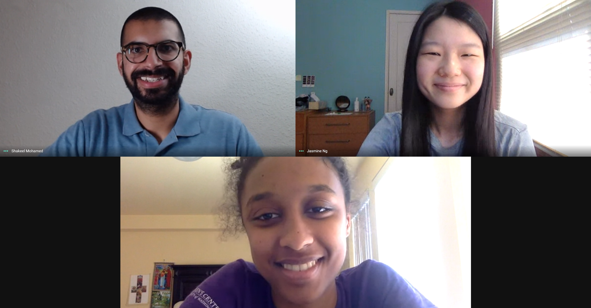

# CodeLabs 2020: Mentoring College Students During a Global Pandemic

<!-- spotifaves screenshot -->
<!-- Include recommendations for books like cracking the coding interview and philosophy of software design -->
<!-- Cracking the coding interview (Shak’s aff lnk) https://amzn.to/3gPkcB6 
Philosophy of Software Design (Shak’s aff link) https://amzn.to/33KTINs
 -->
<!-- TY to Andrew -->

One of the unnoticed groups being affected by the economic slowdown this summer has been college students and recent graduates. With so many companies scaling back many internship programs have been cut entirely. Thousands, if not millions of students around the US have ben left empty handed after already having an internship offer for the summer.

## Codeday comes to the rescue

For those you who don't know about Codeday, they are a non-profit organization committed to helping students learn about technology. Their flagship event, Codeday, is an in-person coding frenzy to work on a project with other students for 24 hours. At the end, they present in front of judges and receive some fun awards. These events are remarkedly different from hackathons because the focus is on learning, instead of wining a cash prize or job offer.

This summer Codeday launched another epic summer program called Codelabs! Codelabs is one month virtual internship program where teams of students get paired up with industry mentors to guide them on a journey to completing an awesome project. It's basically Codeday over a whole month!

I've been involved with CodeDay on and off for about 9 years since they held the first Codeday in 2011 (before it was even called Codeday). In fact, I only applied for an internship at Splunk because I saw that they sponsored a recent Codeday event I attended!

<!-- Talk about project itself, team members, process, screenshots, team photo -->

# Project Spotifaves

## Check out their final project video below!

<iframe width="560" height="315" src="https://www.youtube.com/embed/5KOeTH2f7QI" frameborder="0" allow="accelerometer; autoplay; encrypted-media; gyroscope; picture-in-picture" allowfullscreen></iframe>