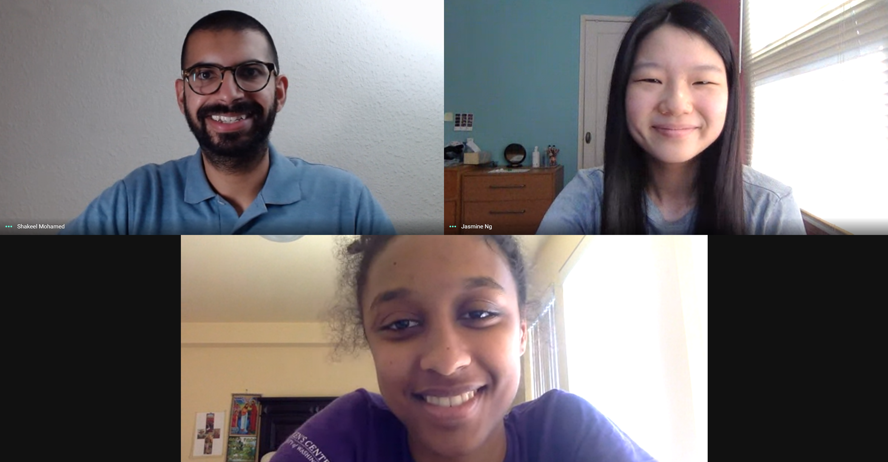
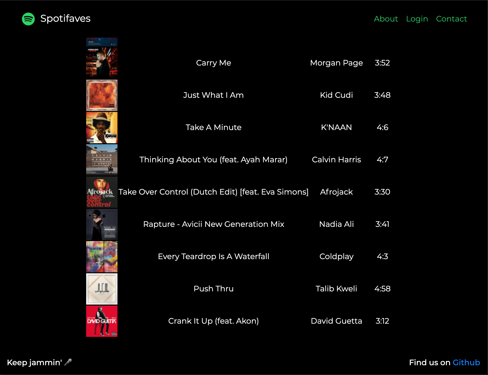

One of the unnoticed groups being affected by the economic slowdown this summer has been college students and recent graduates. With so many companies scaling back, many internship programs have been cut entirely. Thousands, if not millions of students around the US have been left empty-handed after already having an internship offer for the summer.

## Codeday comes to the rescue

For those of you who don't know about [Codeday](https://www.codeday.org/), they are a non-profit organization committed to helping students learn about technology. Their flagship event, Codeday, is an in-person coding frenzy to work on a project with other students for 24 hours. At the end of the event they present in front of judges and receive some fun awards. These events are remarkably different from hackathons because the focus is on learning, instead of winning a cash prize or job offer.

This summer Codeday launched another epic summer program called Codelabs! Codelabs is one-month virtual internship program where teams of students get paired up with industry mentors to guide them on a journey to completing an awesome project. It's Codeday for a whole month!

I've been involved with CodeDay on and off for about 9 years since they held the first Codeday in 2011 (before it was even called Codeday). Coincidentally, I only applied for an internship at Splunk because I saw that they sponsored a recent Codeday event I attended, and I'm still working there!

When Codelabs was announced, it was a no-brainer: I had to register as a mentor. I knew I had a busy summer coming up already, so I asked to have a project selected for my team.

## My awesome mentees

As you saw in the team photo above, [Jasmine Ng](https://www.linkedin.com/in/jasmineng227/) and [Mekedes Dejenie](https://www.linkedin.com/in/mekedes-dejenie-aabb55168/) were my mentees during the Codelabs internship program. I was impressed by their commitment to take time out of their summer to further their tech education. Given the already fully remote nature of work-life during COVID-19, it was relatively straightforward for me to meet with them twice per week over Google Meet calls.

It was really cool to see how well they worked together, given that they'd never met each other before this internship! Beyond that, Mekedes was located nearer to me in the Seattle area while Jasmine was in New York. Remote work has made things possible that we would've never considered before this pandemic.

## Project Spotifaves

Our project was to create a playlist based on a Spotify user's most frequently played songs. Jasmine suggested the name Spotifaves since we'd be working with a user's favorite tracks. You can see the final result of my most listened to songs below!

You can try out Spotifaves for yourself at [spotifaves.github.io](https://spotifaves.github.io).

## Geeky stuff - process and tools

We met twice per week over Google Meet for an hour, when I'd essentially act as a project manager. About half of our calls were spent on learning concepts or new technologies, the other half was typically spent on adjusting project scope and next steps. Additionally, I had two 1:1 (one to one) calls with them to support them with their personal and professional growth.

Some of our tools:

* [Google Meet](https://meet.google.com): bi-weekly team meetings
* [Trello](https://trello.com): project management using a simple Kanban board
* [GitHub](https://github.com): code hosting
* [You can book me](https://youcanbook.me/): scheduling 1:1 calls with me
* [Slack](https://slack.com): team chat, sharing code, and resources

Jasmine and Mekedes cover the tech stack in-depth in their final project presentation, so I won't steal their thunder too much. I was really impressed with their ability to learn the following concepts in such a short amount of time:

* git: including branching, and the pull request model on GitHub
* [GitHub pages](https://pages.github.com): free static website hosting from GitHub
* OAuth2: the protocol for securely retrieving user data from Spotify
* Spotify developer docs: going through the process of setting up a Spotify app, and learning to use their documentation to solve problems

The main books I recommended to them were:

* [Philosophy of Software Design](https://amzn.to/33KTINs): hands down, the best book on software design I've read and it's very digestible with short chapters
* [Cracking the Coding Interview](https://amzn.to/3gPkcB6): they'll be interviewing for technical internships and jobs soon, and this is required reading in my opinion.

## Final video presentation!

Alright, enough of me rambling on! Check out their [final project video](https://www.youtube.com/embed/5KOeTH2f7QI) below:

<iframe width="560" height="315" src="https://www.youtube.com/embed/5KOeTH2f7QI" frameborder="0" allow="accelerometer; autoplay; encrypted-media; gyroscope; picture-in-picture" allowfullscreen></iframe>

## Thank you

I want to wrap it up here by thanking Codeday for setting up the program and [Tyler Menezes](https://www.linkedin.com/in/tylermenezes/), their Executive Director, for personally reaching out. I also have to give a shout out to our team's bonus mentor, my friend [Andrew Craswell](https://www.linkedin.com/in/andrew-craswell-36235a1a/) who was my teammate for all the Codeday events we attended during college.

I wish [Jasmine](https://www.linkedin.com/in/jasmineng227/) and [Mekedes](https://www.linkedin.com/in/mekedes-dejenie-aabb55168/) all the success in their careers ahead!

Lastly, thank you for reading this far.