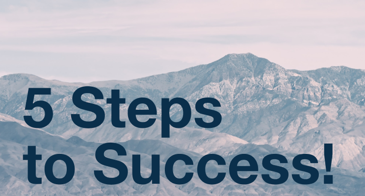

Sometimes our best ideas come as flashes of insight, rather than theories we develop over time. I suppose that has something to do with the power of the subconscious mind.

For those who don't know me, I've been on an intense personal development journey over the past decade. It all started the day after I graduated from high school when I broke down crying on my bedroom floor. Reality had finally caught up to me. **I'm not going to college.** ([Read more about that here.](https://shakeelmohamed.com/posts/2020-06-30-10-lessons-from-my-10-year-journey)) There were a series of momentary setbacks leading up to that moment, but there was only one reason: **I didn't know what was required to be successful.**

Over the years I've attended live seminars, read dozens of books, learned from countless mentors – at some point along the way I found my path to success. Since this pandemic hit, I've found myself becoming a “mentor” of sorts to more people and I haven't found a clear way to share my “success formula” until now. *(I've used quotes to denote that I still have a lot to learn in this lifetime, and I do not have all the answers.)*

A few days ago I was sharing some ideas with a friend and rattled off these five steps to success. I listed them very instinctively and immediately realized I might be onto something special. The formula is quite simple: five steps, one very powerful word each.

*Let's follow the steps for a skill worth learning: speed reading.*

## Step 1: Learn 🧠

It starts with trying to *understand what the thing is you're trying to learn.* You might begin with some Google or Wikipedia searches to understand what speed reading is. Then you might head to YouTube and find a video from Tim Ferriss talking about some easy techniques to get started. If you want to go deep, you might ironically [buy a book about speed reading](https://smile.amazon.com/Spd-Rdng-Techniques-Strategies-Accelerated-ebook/dp/B0047O2DRI/) (I did this) or enroll in a course on the topic. 

<iframe width="560" height="315" src="https://www.youtube.com/embed/ZwEquW_Yij0" frameborder="0" allow="accelerometer; autoplay; clipboard-write; encrypted-media; gyroscope; picture-in-picture" allowfullscreen></iframe>

## Step 2: Apply 💪🏽

At this point, you have an intellectual understanding of the skill is and how to start practicing it. I think this is where many people go wrong. When you first start a new skill, you will suck. That's the whole point - *you're trying to get better*! Applying your knowledge is the only way to turn ideas into tangible skills. To practice speed reading, you might time yourself reading one page twice per day while tracking your speed.

## Step 3: Grow 🚀

After a few days, weeks, or months of *consistent practice*, you will improve. The way you improve may not be exactly what you expect. Your reading speed might increase, but your comprehension may also improve. Maybe you even feel more at ease while speed reading, don't overlook these kinds of extra benefits of your hard work!

## Step 4: Reflect 🤔

At some point, you will reach a relative level of mastery over that skill, sometimes without even realizing it. When you notice something becoming automatic or easy, pause to reflect. Think about the progress you've already made until that point, and *smile about it!* It also helps to think about what helped you learn over time, maybe even revisit some of those tools as a refresher.

## Step 5: Share 🗣

Of course, I've saved the best for last - *share your experience with others!* When you're able to teach a skill, you know you've reached a whole new level of understanding. Once you start conversations about learning a specific skill, you might learn more ideas from everyone you talk to.

*Thank you to [Ammn Meghani](https://www.linkedin.com/in/ammnmeghani/) for inspiring this formula 💡, and [Sahil Maherali](https://www.linkedin.com/in/sahilmaherali/) for emoji coaching 🙏🏽.*

## Bonus Section 🎉

No, I didn't forget to follow my own advice! Here are my top 3 tips for speed reading:

1. Don't allow your eyes to move to the edges of the page, keep them within the middle 50%. Your peripheral vision will pick up the rest of the words, it takes some practice but you'll get there.
2. Follow your finger down the middle of the page, rather than left to right. This will force you to set the pace you're reading lines of text, rather than words.
3. Stop reading every word aloud in your mind, you can read without silently pronouncing each word in your mind. It's a bit counterintuitive since we usually learn to read aloud.
