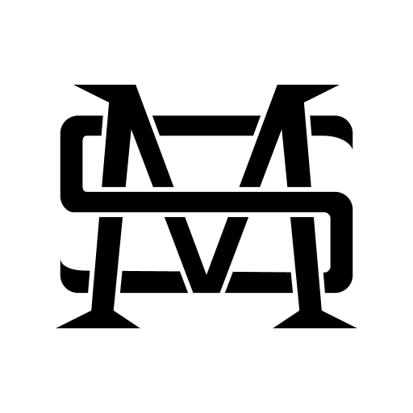

# TODO

Good reference for pug x 11ty:
https://cardiff.marketing/pug-in-eleventy-making-it-work/

# ASAP

- [ ] add SVG favicon

- [ ] Need some photography + design comps (think campaigns/ads) in each project
- [ ] Covers: mini highlight videos for MJ (cleanup existing motion, maybe rebuild), Rothko, MR (astrology chart concept... make a storyboard)
- [ ] add "creative tech" or similar tag/page once 3 projects are up
- [ ] Update labyrinth with new content
- [ ] fix broken link to break presentation (on project page)
- [ ] portfolio-content bottom margin seems tight compared to caption leading
- [ ] 😵‍💫 Rework projects to have a cover.png shown at the top (ideally its the same image as the OG, just scaled up + higher res) -> scale should be about 1920x1200, the OG size feels too wide for cover images
    - [ ]  This is done... but some of the images/videos are too low res (aka they are OG size not super HD+ size); then set showCover=true in frontmatter
- [ ] homepage add CTA -> work page “for more”
- [ ] test primary domain migration to shakeel.design
    - [X] new repo /test -> manual copy docs directory from here, see flippy-flip.github.io
    - [ ] replace domains
    - [ ] add CNAME
    - [ ] push to test.shakeel.design
    - [ ] ensure test.shakeelmohamed.com redirects cleanly
    - [ ] figure out how to avoid SEO hit when doing the same thing with this repo
- [ ] later on, time all covers to 5s at 60fp exactly and even preview them so they sync/loop mostly perfectly
- [ ] Custom media type pages
    - [ ] add motion reel to /motion/index.html, maybe setup
    - [ ] More context to /type-design/index.html

## New footer WIP

Also remove the hr above it, need to fix body margin-bottom to 0, etc.

```html
<footer class="newfooter full-width" style="
    padding-left: 2rem;
    padding-right: 2rem;
    padding-top: 4rem;
    background-color: #dcd8cd;
    align-items: baseline;
    padding-bottom: 4rem;
    margin-bottom: -4rem;
">
            <div><br class="mobile-only"><a class="logo-wrapper" href="/">
                    <script>document.write("&copy; " + new Date().getFullYear() + " Shakeel Mohamed.")</script>© 2026 Shakeel Mohamed.</a></div>
            <div><a href="https://instagram.com/shakeel.design" target="_blank">Instagram</a></div>
            <div><a href="https://linkedin.com/in/shakeelmohamed" target="_blank">LinkedIn</a></div>
            <div><a href="mailto:hello@shakeel.design" target="_blank"><span class="mailto">
                        <script type="text/javascript">
                            function gen_mail_to_link(lhs, rhs, subject, text) {
                                const rhs_subj = subject ? `${rhs}?subject=${subject}` : rhs;
                                const _txt = text ? text : `${lhs}@${rhs}`;
                                const generated = `<a class="mailto" href="mailto:${lhs}@${rhs_subj}" target=_blank>${_txt}</a>`;
                                document.write(generated);
                            }
                            gen_mail_to_link("hello", "shakeel.design", "", "")
                            
                        </script></span></a><a class="mailto" href="mailto:hello@shakeel.design" target="_blank">hello@shakeel.design</a></div>
        </footer>
```


## Cleanup

- [ ] Replace all avif/gif files with .mp4
- [ ] use <footer>, etc structured markup; rename newheader, newfooter CSS classes accordingly
- [ ] resolve rules and tighten up spacing when header comes after a rule; probably remove rule from the header markup if possible; (Started with hr.rule class)
- [ ] Fix right margin issues on tablet / half-width desktop size
- [ ] Rework about page layout, everything is too dense as is
- [ ] Lots of strange layout issues on mobile
- [ ] Remove all backwards compat CSS after full semantic HTMl re-organization
- [ ] Add size optimization for og/cover images, can save lots of bandwidth on mobile
- [ ] Lots of CSS tricks for website, especially the pure HTML menu button
    - [ ] https://youtu.be/Ol62e-dWu0E?si=upqWiVo_qzMi_Am0
    - [ ] https://youtu.be/pYW3O0AxpI8?si=yP-fI72i1TvTUotJ
- [ ] why aren't pages like /branding in the sitemap?
- [ ] restructure home page so type design projects drop below portfolio projects; maybe do this once I start a 4th typeface... OR just show those as a 3-up row
- [ ] at least for blog posts, YT videos need some helper function to apply the following CSS: `width: 100%; height: auto; aspect-ratio: 16 / 9;`

# 10k24

- [ ] after the case study is up and thorough, get some press
    - [ ]  Octave + Adelle Mono on fonts in use: https://fontsinuse.com/typefaces/210887/octave + https://fontsinuse.com/typefaces/131711/adelle-mono
    - [ ]  Can also get Referential Mono on there probably; might need to hit the min charset and publish it first: https://foundrysupport.monotype.com/hc/en-us/articles/360029280752-Recommended-Character-Set
    - [ ] Publish RM with a specimen and license on Gumroad, might as well make it free maybe OSS too

# Midjourney

- [ ] brand guidelines
- [ ] brand book flip through with motion, show spiral binding and lots of great editorial speads
- [ ] update project summary
- [ ] caustic dispersion (light refraction) with logo in Blender
- [ ] Need to optimize it for skimming, missing all the good stuff with the slideshows
- [ ] spend 3 hours on motion (new storyboard, logo decomposition into layers, production), goal should be 10 seconds max
- [ ] SIMPLE web and mobile UI screens / scroll motion
- [ ] motion (logo reveal, 15-30s piece, product UI features)
- [ ] brand inspiration book (better name)
- [ ] add presentation design
- [ ] add research and strategy deck, build it out + show thumbs
- [ ] keep working on lighting in the installation scene, renders have some odd ghosting on the left side from the HDR
- [ ] show prompts
- [ ] could 3D model the exterior facade for the conf, and make a wayfinding program with a clear system + grid
- [ ] can show wall crit process


# Rothko

- [ ] photoshoot outside of me holding fabric poster(s), or better renders with fabric sim
- [ ] update all book imgs, missing some stills instead of all gifs
- [ ] try to match background colors to the brand gray tone
- [ ] why is the book cover so pixelated, esp PBS logo? investigate

# Thesis

- [ ] Include a validation section, this becomes material for future talks. Validation from: Google Career Dreamer, Creative People x Nali (non-linear career story), Meg Lewis new brand, Melinda Livsey, Chris Do’s own career path, etc.
    - [ ]  Talk outline: hook, what is AD + thesis overview, proof, case studies, hey look I did this already (dev -> design -> 10k24), you can do it too.
- [ ] update website mockup (PSD -> AE workflow)
- [ ] add quiz mockup on iPad (motion)
- [ ] Can expand the conferences stuff to show clear spec like retail/env. design
- [ ] social media, re-do it
- [ ] the quiz!
- [ ] process book, more spreads
- [ ] other sketches, ideation from fall
- [ ] Include thesis process images
- [ ] Thesis: what are the points of my talk? some high level ideas, or takeaways... still unclear what I am bringing to expand the perceived value of designers

# TPS

- [ ] Create wayfinding system using clean grid
- [ ] wristband motion... there is no face between inside/outside oops! Also make it loop perfectly
- [ ] use the pattern as a lining for either stationery, apparel, bag lining, or something else for VIPs
- [ ] VIP stationery mockup with vellum, etc.
- [ ] show motion design system (3x vertical social posts, LT, slates/bumpers) - show the system/grid, adaptive resizing
- [ ] re-do social media mockup, looks a bit low saturation, dark mode UI would help
- [ ] Redo mockups for TPS tickets, start from a clean INDD file -> PSD, maybe even do Blender mockups
- [ ] use this for website particle physics (better than three.js): https://github.com/naughtyduk/particlesGL
- [ ] process is missing
- [ ] maybe show lightsail itself in the motion reveal?
- [ ] make the 30s trailer idea I’ve been thinking about with music, etc.
- [ ] digital signage motion posters
    - [ ] may be easier in p5.js 2.0 instead of vibe coding... https://beta.p5js.org/reference/p5/worldtoscreen/; and custom shaders https://beta.p5js.org/tutorials/intro-to-glsl/; https://beta.p5js.org/examples/advanced-canvas-rendering-shader-as-a-texture/
- [ ] more micro touchpoints, so many beautiful print materials - especially the vellum and metallic stuff. Play with Blender renders on this
    - [ ] https://blender.stackexchange.com/questions/131930/translucent-material-a-sheet-of-paper-with-image-texture
- [ ] Social media design ~~~~ need it in portfolio now! (thesis so far)
- [ ] merch - where’s the jacket + hat?

# Mindful Roman

- [ ] update colors to match personal ID system
- [ ] motion cover / screen recording from glyphs typing interface
- [ ] poster has kinda tight leading on the 3 paragraphs, I think... need to check at full scale
- [ ] do some motion gifs/stills of the font2 specimen sheets I made, fun play on the day/night concept
- [ ] gendesign whole astrology chart for IG stories... oh yeah 
- [ ] some ephemera like all 12 astrology sign info cards or stickers idk; basically push the astrology concept more
- [ ] lifestyle brand packaging mockups (actually, can just make a whole pkg lifestyle brand)

# Ontology

- [ ] Include more process photos from my WIP presentation
- [ ] fix composition for "Ontology - 15.png", the leading is not right
- [ ] re-export all the gif/avif spread-mockups at higher res, the small type is a bit pixelated
- [ ] Do I need avif fallback? Ontology is using them and it’s really nice... can I get away with no gifs on the website?
- [ ] Kourosh Beigpour’s typeface was Arabic, then Latin also!
- [ ] Lots of testing proofing info https://github.com/Tarobish/Mirza
- [ ] https://kbstudio.net/works/fonts/

# Referential Mono

- [ ] specimen content needs more “early computing” content
- [ ] fix mobile alignment issues with center or right align
- [ ] crit/printed process, kashida/Eid motion, what about the posters?
- [ ] show research kufic chart also
- [ ] show stickers from grad show
- [ ] motion, like Kashida, etc.

# Salgirah

- [ ] Salgirah + others, fix weird images sizes + replace all content, can make it flatter + break up the carousels so it reads cleanly


# Digital Anarchy

- [ ] Rough out some UI/web case study (maybe Digital Anarchy)

# Projects

- [ ] Make an overview gif for each project cover (fallback to still for OG)
- [ ] check OG images for projects, then posts, etc. Consider gif/video versions
- [ ] move all logo family / kit of parts stuff to the bottom of each project (before process)

## About / Bio revision

- [ ] Something about “0 to 1” and “1 to infinity” as a designer
- [ ] Industries of interest: deep tech, cultural organizations, what else?
- [ ] Experience... consider Parenthetical titles or in 1 line summary at the top: Product Manager (Functionally leading roadmap without formal title)
- [ ] Future bio update: I’m interested in environmental design, creative technology, and Arabic type design.
- [ ] Can set up thesis in my bio a bit to speak more maturely as being an advocate and helping others to become advocates.
- [ ] Need a new tagline! 3 key ideas: advocate/community for designers, cross-disciplinary approach, and typography is central to everything I do.
- [ ] ...(longer form about me could build) ... this began in my past career as a software engineer where I built my analytical thinking skills, while understanding the need for clearer communication about the technologies I was building...
- [ ] Overall positioning through leadership, technical expertise, and economy design


Others
- [ ] CTA footer on all pages?
- [ ] Make a separate landing page for freelance/contract work, e.g.: /services or something
    - [ ]  copy on this page should be something like "clarify brand, build trust" - basically speaking to the outcomes and results of design
- [ ] Slideshows need arrow icons to be visible that there is more there (vs. looking like a gif)
- [ ]   website (Thesis, TPS, Midjourney)
- [ ] Think about cursor or other interaction/motion points using the icon logo
- [ ] accessibility check, definitely needs help: https://www.accessibilitychecker.org/audit/?website=shakeelmohamed.com&flag=ww#

## Labyrinth

- [ ] add more 3D stuff to labyrinth
- [ ] Can update bio to speak about trained as a designer all along (clearly explain why I changed careers)
- [ ] Labyrinth: include more things like WHP, community photos, etc.

## Break

- [ ] Move the giant inline form/CSS payload out of src/break/index.pug:85 into a partial or external asset.


## From Petrula

- hiring + creative talent
- less spreads for Rothko, less motion on egawa just make it stills
- say documentary
- better transition between projects
- thesis at the end + lead in with speaking
- research was informed by deep research, the next project is also a deep exploration of that + includes my work for Mark Rothko

## Positioning reflection @ graduation

I have the rest of my life to prove this thesis - this is my design philosophy

There’s nothing left to prove, I already did that throughout my entire MFA before this

like PV said “I’m already over-qualified to speak about my thesis”

I need to claim my expertise, balance with humility

I didn’t come to accd to become a GD, but edu limits that scope + industry definition of GD…. 
——> would be more respected in 20 years
— > I never wanted to be the BEST GD

Teaching would be rly good for me, but need to find a better fit

Hermes - highest vis sponsored studio ever, and being the TA is the validation fs


## Grad show

- [ ] Can turn this into a project page for branding / personal ID with lots of documentation, grad show, EGD, motion, 3D models, etc.
- [ ] Link to to graduation walk, maybe make a YT clip: https://youtu.be/SASQKIg3VY4?t=5040
- [ ] I am running into lots of issues here... Can show a 3D model of the wall too, host on sketchfab w/ annotations: https://support.fab.com/s/article/Annotations
    - [ ] See also: https://github.com/sketchfab/blender-plugin/releases/tag/1.6.1
- [ ] Spinning 3D model of biz card would be so cool

# P3

- [ ] secret/hidden landing pages for video editing, tech, etc.
- [ ] hmm (security) Add rel="noopener noreferrer" to external links; https://linkbuilder.io/rel-noopener-noreferrer/
- [ ] Media-specific pages could have more detail/context, scrollable images... TBD
    - [x] Type design list page (ideally I have all the tag-specific pages auto generated, otherwise I can curate the ones I need by skill (type design, branding, motion, editorial, web))
- [ ] maybe add a spacer for empty grid divs... https://github.com/shakeelmohamed/shakeelmohamed.github.io/pull/181#discussion_r2114879681; see also https://github.com/shakeelmohamed/shakeelmohamed.github.io/pull/181#discussion_r2114880664
- [ ] multi-column text settings for all fonts would be helpful to see


## LATER

- [ ] Pick an intentional typeface for code blocks, maybe TT Commons Mono?
- [ ] Explore using fluid typography...
    - [ ] https://fluidtypography.com/#usarusFluidTypographyGetStarted
    - [ ] https://codepen.io/iamryanyu/pen/gbpWGYQ
- [ ] Overall, consider bringing in on-scroll animations just really get them clean - or just use those tools for projects... see https://motion.dev/
- [ ] How might I reframe all projects to speak to expertise vs. the project… (e.g. More about me… through Rothko….. vs. about Rothko)
- [ ] How can symbol make it onto the about page? ugh
- [ ] Update all website meta descriptions, “holds an MFA” is not so interesting
- [ ] check favicon colors against printed materials
- [ ] Look at some SEO tricks for primary featured images, could be nice to get my whole portfolio showing in search results: https://stackoverflow.com/questions/32577999/how-can-i-add-schema-org-primaryimageofpage-in-my-site
- [ ] Setup 404 tracking w/ GA: https://www.analyticsmania.com/post/track-404-errors-with-google-analytics-google-tag-manager/#ga4-gtm
- [ ] Design 404 page; https://www.404s.design/; consider an opportunity for generative design
- [ ] Fix issues with mobile font tester [WIP might be okay now]
- [ ] All through MFA I was working on typefaces because they did X for me; the result is I can see comms symbols/forms in a whole new way. I understand the rigor of what it takes to find mastery of craft. [In interviews, speak about myself vs. describing the fonts themselves, consider speaking to hiring manager as non-designers.] How will it benefit a team?
    - [ ] ...(related) I have been modifying type for identity projects (Rothko and Midjourney) which began my interest in type design
- [ ] WHP: maybe rename since Studio Matthews had a show called “your words have power”
- [ ] Labyrinth description: value is my intelligent approach to work, skillful ability to work in simplicity and complexity, dedication to community, learning in formal/informal/digital settings - one of my biggest strengths
- [ ] TODO: optimize email obfuscation: https://github.com/shakeelmohamed/shakeelmohamed.github.io/pull/161#discussion_r1976589880; and https://github.com/shakeelmohamed/shakeelmohamed.github.io/pull/161#discussion_r1976589879


## My notes
- [ ] Start posting on Behance!
- [ ] Perhaps use cover.png instead of opengraph for project thumbnails
- [ ] Can include small images for AIGA talks on about page... BELOW the resume area
- [ ] Overall, I need to clean up all overview descriptions, there are a bit loose at the moment. Writing center is a good move there.
- [ ] Revisit footer design, some inspo: https://www.footer.design/, https://www.footer.design/styles/typographic


## Low priority

- [ ] Rework semantics for SEO for: h1/h2/etc
- [ ] JS to prevent bad breaks (widows / orphans) - maybe solved with text-wrap-style: balance;
- [ ] figure out how to show extra process (another slider, hidden section, etc.)
- [ ] do I need to do anything with artsthread profile? recognition? https://www.artsthread.com/portfolios/applied-designer-mfa-thesis

## Consider Revisiting

- [ ] Footer: need a home link (rough added to my name, can it be more obvious) + headshot and clear CTA
- [ ] HSTS support via cloudflare? Not sure if this still works with github pages
- [ ] ALL CAPTIONS: automate check for periods at the end
- [ ] add &nbsp; automatically between the last word gap to prevent widows
